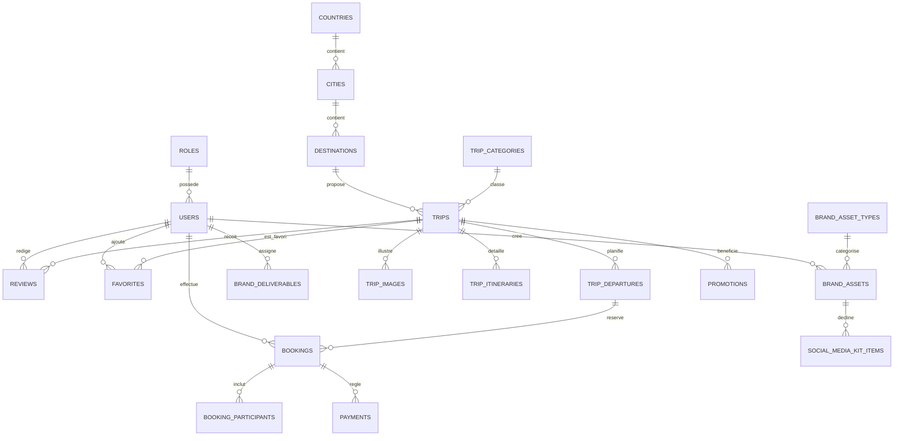

# Modèle de Données - EvasionVoyage

Schéma de base de données (MySQL 8 / Laravel 12) couvrant :
- **Module A** — Gestion des assets d'identité visuelle (issu du [Cahier des charges](./Cahier_des_charges_Identite_Visuelle_EvasionVoyage.md) et du [TODO](./TODO_Identite_Visuelle_EvasionVoyage.md))
- **Module B** — Cœur métier de la plateforme de réservation de voyages

Conventions : `id` = `BIGINT UNSIGNED AUTO_INCREMENT` (clé primaire Laravel par défaut), toutes les tables ont `created_at` / `updated_at` (timestamps Laravel), les suppressions logiques (`deleted_at`) sont indiquées quand pertinentes.

---

## Module A — Identité Visuelle & Assets de Marque

### `brand_asset_types`
Types de livrables (logo, favicon, charte, etc.)

| Colonne | Type | Contraintes | Description |
|---|---|---|---|
| id | BIGINT UNSIGNED | PK | |
| name | VARCHAR(100) | UNIQUE | logo, favicon, kit_reseaux_sociaux, charte_graphique, guide_utilisation |
| description | TEXT | NULL | |

### `brand_assets`
Fichiers concrets du logo et de ses déclinaisons.

| Colonne | Type | Contraintes | Description |
|---|---|---|---|
| id | BIGINT UNSIGNED | PK | |
| asset_type_id | BIGINT UNSIGNED | FK → brand_asset_types.id | |
| name | VARCHAR(150) | | |
| version | ENUM | couleur, monochrome, noir, blanc, horizontal, vertical, icone, favicon | |
| file_path | VARCHAR(255) | | chemin storage |
| format | ENUM | svg, png, pdf, ico | |
| file_size_kb | INT | NULL | |
| status | ENUM | brouillon, en_revue, approuve, publie | défaut: brouillon |
| created_by | BIGINT UNSIGNED | FK → users.id | |
| created_at / updated_at | TIMESTAMP | | |

### `brand_colors`
Palette de couleurs officielle.

| Colonne | Type | Contraintes | Description |
|---|---|---|---|
| id | BIGINT UNSIGNED | PK | |
| name | VARCHAR(50) | | Bleu, Orange, Blanc, Gris |
| hex_code | VARCHAR(7) | | ex: #0A6EBD |
| rgb_code | VARCHAR(20) | NULL | |
| cmyk_code | VARCHAR(20) | NULL | pour impression |
| usage_type | ENUM | primaire, secondaire, neutre | |

### `brand_typographies`
Typographies officielles.

| Colonne | Type | Contraintes | Description |
|---|---|---|---|
| id | BIGINT UNSIGNED | PK | |
| name | VARCHAR(100) | | Poppins, Inter, Open Sans |
| usage_type | ENUM | titres, texte | |
| font_file_path | VARCHAR(255) | NULL | |
| weights | JSON | NULL | ex: [400,600,700] |

### `brand_guidelines`
Documents de référence (charte, guide d'utilisation).

| Colonne | Type | Contraintes | Description |
|---|---|---|---|
| id | BIGINT UNSIGNED | PK | |
| title | VARCHAR(150) | | |
| type | ENUM | charte_graphique, guide_utilisation | |
| file_path | VARCHAR(255) | | PDF |
| version | VARCHAR(20) | | ex: v1.0 |
| published_at | DATE | NULL | |

### `social_media_kit_items`
Déclinaisons pour les réseaux sociaux.

| Colonne | Type | Contraintes | Description |
|---|---|---|---|
| id | BIGINT UNSIGNED | PK | |
| brand_asset_id | BIGINT UNSIGNED | FK → brand_assets.id | |
| platform | ENUM | facebook, instagram, linkedin, x, youtube | |
| item_type | ENUM | photo_profil, couverture, template_post | |
| width_px | INT | NULL | |
| height_px | INT | NULL | |

### `brand_deliverables`
Suivi des tâches du cahier des charges (miroir du TODO.md).

| Colonne | Type | Contraintes | Description |
|---|---|---|---|
| id | BIGINT UNSIGNED | PK | |
| category | ENUM | fondations, declinaisons_logo, documentation, kit_reseaux, verifications | |
| title | VARCHAR(200) | | |
| priority | ENUM | haute, moyenne, basse | |
| status | ENUM | a_faire, en_cours, termine | défaut: a_faire |
| assigned_to | BIGINT UNSIGNED | FK → users.id, NULL | |
| due_date | DATE | NULL | |
| completed_at | TIMESTAMP | NULL | |

**Relations Module A**
- `brand_assets.asset_type_id` → `brand_asset_types.id`
- `brand_assets.created_by` → `users.id`
- `social_media_kit_items.brand_asset_id` → `brand_assets.id`
- `brand_deliverables.assigned_to` → `users.id`

---

## Module B — Plateforme de Réservation de Voyages

### `roles`
| Colonne | Type | Contraintes | Description |
|---|---|---|---|
| id | BIGINT UNSIGNED | PK | |
| name | VARCHAR(50) | UNIQUE | admin, agent, client |

### `users`
| Colonne | Type | Contraintes | Description |
|---|---|---|---|
| id | BIGINT UNSIGNED | PK | |
| role_id | BIGINT UNSIGNED | FK → roles.id | |
| name | VARCHAR(150) | | |
| email | VARCHAR(150) | UNIQUE | |
| password | VARCHAR(255) | | |
| phone | VARCHAR(30) | NULL | |
| avatar | VARCHAR(255) | NULL | |
| email_verified_at | TIMESTAMP | NULL | |
| deleted_at | TIMESTAMP | NULL | soft delete |

### `countries`
| Colonne | Type | Contraintes | Description |
|---|---|---|---|
| id | BIGINT UNSIGNED | PK | |
| name | VARCHAR(100) | | |
| iso_code | VARCHAR(3) | UNIQUE | |

### `cities`
| Colonne | Type | Contraintes | Description |
|---|---|---|---|
| id | BIGINT UNSIGNED | PK | |
| country_id | BIGINT UNSIGNED | FK → countries.id | |
| name | VARCHAR(100) | | |

### `destinations`
| Colonne | Type | Contraintes | Description |
|---|---|---|---|
| id | BIGINT UNSIGNED | PK | |
| city_id | BIGINT UNSIGNED | FK → cities.id | |
| name | VARCHAR(150) | | |
| slug | VARCHAR(170) | UNIQUE | |
| description | TEXT | NULL | |
| cover_image | VARCHAR(255) | NULL | |

### `trip_categories`
| Colonne | Type | Contraintes | Description |
|---|---|---|---|
| id | BIGINT UNSIGNED | PK | |
| name | VARCHAR(100) | | plage, montagne, culturel, aventure... |
| slug | VARCHAR(120) | UNIQUE | |

### `trips` (voyages)
| Colonne | Type | Contraintes | Description |
|---|---|---|---|
| id | BIGINT UNSIGNED | PK | |
| destination_id | BIGINT UNSIGNED | FK → destinations.id | |
| category_id | BIGINT UNSIGNED | FK → trip_categories.id | |
| title | VARCHAR(200) | | |
| slug | VARCHAR(220) | UNIQUE | |
| description | TEXT | NULL | |
| duration_days | SMALLINT UNSIGNED | | |
| base_price | DECIMAL(10,2) | | |
| max_participants | SMALLINT UNSIGNED | | |
| status | ENUM | brouillon, publie, archive | défaut: brouillon |
| created_by | BIGINT UNSIGNED | FK → users.id | |
| deleted_at | TIMESTAMP | NULL | soft delete |

### `trip_images`
| Colonne | Type | Contraintes | Description |
|---|---|---|---|
| id | BIGINT UNSIGNED | PK | |
| trip_id | BIGINT UNSIGNED | FK → trips.id | |
| image_path | VARCHAR(255) | | |
| is_cover | BOOLEAN | défaut: false | |
| display_order | SMALLINT | défaut: 0 | |

### `trip_itineraries`
| Colonne | Type | Contraintes | Description |
|---|---|---|---|
| id | BIGINT UNSIGNED | PK | |
| trip_id | BIGINT UNSIGNED | FK → trips.id | |
| day_number | SMALLINT UNSIGNED | | |
| title | VARCHAR(200) | | |
| description | TEXT | NULL | |

### `trip_departures`
Dates de départ disponibles pour un voyage.

| Colonne | Type | Contraintes | Description |
|---|---|---|---|
| id | BIGINT UNSIGNED | PK | |
| trip_id | BIGINT UNSIGNED | FK → trips.id | |
| start_date | DATE | | |
| end_date | DATE | | |
| available_seats | SMALLINT UNSIGNED | | |
| price_override | DECIMAL(10,2) | NULL | |

### `bookings` (réservations)
| Colonne | Type | Contraintes | Description |
|---|---|---|---|
| id | BIGINT UNSIGNED | PK | |
| user_id | BIGINT UNSIGNED | FK → users.id | |
| trip_departure_id | BIGINT UNSIGNED | FK → trip_departures.id | |
| booking_reference | VARCHAR(30) | UNIQUE | |
| number_of_participants | SMALLINT UNSIGNED | | |
| total_price | DECIMAL(10,2) | | |
| status | ENUM | en_attente, confirmee, annulee | défaut: en_attente |

### `booking_participants`
| Colonne | Type | Contraintes | Description |
|---|---|---|---|
| id | BIGINT UNSIGNED | PK | |
| booking_id | BIGINT UNSIGNED | FK → bookings.id | |
| full_name | VARCHAR(150) | | |
| birth_date | DATE | NULL | |
| passport_number | VARCHAR(50) | NULL | |

### `payments`
| Colonne | Type | Contraintes | Description |
|---|---|---|---|
| id | BIGINT UNSIGNED | PK | |
| booking_id | BIGINT UNSIGNED | FK → bookings.id | |
| amount | DECIMAL(10,2) | | |
| payment_method | VARCHAR(50) | | carte, virement, paypal... |
| transaction_id | VARCHAR(100) | NULL | |
| status | ENUM | en_attente, paye, echoue, rembourse | |
| paid_at | TIMESTAMP | NULL | |

### `reviews` (avis)
| Colonne | Type | Contraintes | Description |
|---|---|---|---|
| id | BIGINT UNSIGNED | PK | |
| user_id | BIGINT UNSIGNED | FK → users.id | |
| trip_id | BIGINT UNSIGNED | FK → trips.id | |
| rating | TINYINT UNSIGNED | 1 à 5 | |
| comment | TEXT | NULL | |
| status | ENUM | en_attente, approuve, rejete | défaut: en_attente |

### `favorites`
| Colonne | Type | Contraintes | Description |
|---|---|---|---|
| id | BIGINT UNSIGNED | PK | |
| user_id | BIGINT UNSIGNED | FK → users.id | |
| trip_id | BIGINT UNSIGNED | FK → trips.id | |
| | | UNIQUE(user_id, trip_id) | |

### `promotions`
| Colonne | Type | Contraintes | Description |
|---|---|---|---|
| id | BIGINT UNSIGNED | PK | |
| trip_id | BIGINT UNSIGNED | FK → trips.id, NULL | NULL = promo globale |
| code | VARCHAR(30) | UNIQUE | |
| discount_type | ENUM | pourcentage, montant_fixe | |
| discount_value | DECIMAL(10,2) | | |
| valid_from | DATE | | |
| valid_to | DATE | | |

### `contact_messages`
| Colonne | Type | Contraintes | Description |
|---|---|---|---|
| id | BIGINT UNSIGNED | PK | |
| name | VARCHAR(150) | | |
| email | VARCHAR(150) | | |
| subject | VARCHAR(200) | NULL | |
| message | TEXT | | |
| status | ENUM | nouveau, lu, repondu | défaut: nouveau |

### `newsletter_subscribers`
| Colonne | Type | Contraintes | Description |
|---|---|---|---|
| id | BIGINT UNSIGNED | PK | |
| email | VARCHAR(150) | UNIQUE | |
| subscribed_at | TIMESTAMP | | |
| unsubscribed_at | TIMESTAMP | NULL | |

**Relations Module B**
- `users.role_id` → `roles.id`
- `cities.country_id` → `countries.id`
- `destinations.city_id` → `cities.id`
- `trips.destination_id` → `destinations.id`
- `trips.category_id` → `trip_categories.id`
- `trips.created_by` → `users.id`
- `trip_images.trip_id` → `trips.id`
- `trip_itineraries.trip_id` → `trips.id`
- `trip_departures.trip_id` → `trips.id`
- `bookings.user_id` → `users.id`
- `bookings.trip_departure_id` → `trip_departures.id`
- `booking_participants.booking_id` → `bookings.id`
- `payments.booking_id` → `bookings.id`
- `reviews.user_id` → `users.id`
- `reviews.trip_id` → `trips.id`
- `favorites.user_id` → `users.id`
- `favorites.trip_id` → `trips.id`
- `promotions.trip_id` → `trips.id` (nullable)

---

## Diagramme Entité-Relation (vue d'ensemble)

---

## Notes d'implémentation Laravel

- Toutes les FK utilisent `->constrained()->cascadeOnDelete()` sauf `promotions.trip_id` (nullable → `nullOnDelete()`) et `brand_deliverables.assigned_to` (nullable → `nullOnDelete()`).
- `trips`, `users` : soft deletes (`SoftDeletes` trait) pour conserver l'historique des réservations.
- Index recommandés : `trips.slug`, `destinations.slug`, `bookings.booking_reference`, `users.email` (déjà UNIQUE).
- Les tables du Module A peuvent être gérées via un panneau d'administration (ex: Filament) pour suivre l'avancement des livrables du cahier des charges.
